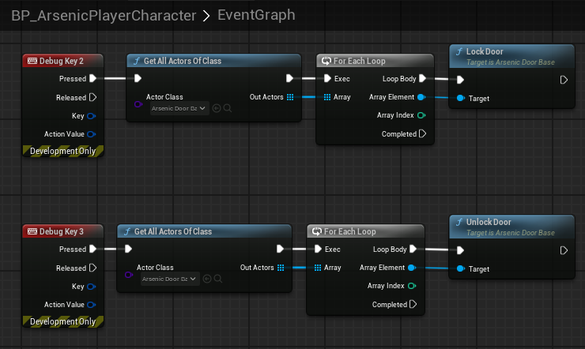

# Doors

## Overview

Doors inherit from `AArsenicInteractActorBase` and have their own base class `AArsenicDoorBase`. In order for the doors to manage their state as `World Partition` loads and unloads them, as well as integrating with the save system, doors must have a `UniqueDoorName`. For organizational purposes I strongly recommend using the following format: “`CardinalDirection RoomName DoorName DoorNumber`”. For example, a door in the atrium might have the name “`West Atrium HiddenDoor 0`”. You are not required to follow this naming convention, but it will be very hard to have duplicate door names with this system. Keep in mind that if door names are duplicated their state will ***not*** be saved/loaded properly. 

Doors get split into child classes to make things easier for designers, however this means that some doors have different features than others. Here are some features and functions that you’ll find in the various door classes:

- `bool StartOpened;`
- `bool CloseDoorAutomatically;`
- `TrySlamDoor();` - called when the door gets locked while the door is open
- `float SlamSpeedMultiplier;` - Multiplied by `DefaultDoorSpeed` when the door gets slammed
- `LockDoor();`
- `UnlockDoor();`

There are also several **blueprint implementable events** that can be called by designers in blueprint to spawn sounds and handle other behaviors:

- `OnDoorLocked();`
- `OnDoorUnlocked();`
- `OnDoorStartOpen();`
- `OnDoorFinishOpen();`
- `OnDoorStartClose();`
- `OnDoorStartSlam();`
- `OnDoorFinishClose();`
- `OnActionTextChanged();`
- `OnDoorStateLoaded();`

For optimization purposes, doors do not use collision spheres to detect when the player is nearby. Instead, every second (or half-second for sliding doors) the distance between the door and player is calculated and automatic doors will open and close when certain thresholds are met. This means that thresholds need to be *slightly higher* than expected due to the delay in distance calculations.

There are some helpful debug tools set up on the player character to lock and unlock doors for testing, but I can’t promise that functionality will stick around forever:

---
## AArsenicDoubleDoor

Because of the need for a second mesh and second open point vector, this child class was created. They should be able to just be dragged into the world and work as expected. There are many configurable variables you can set in the details panel if you want different behavior.

---
## BP_SingleSlidingDoor

These are configurable to be **vertical** sliding doors and **horizontal** sliding doors. The `OpenPoint1` **vector** just needs to be manipulated to achieve the desired result. To anyone reading this, you’re welcome to create another `AArsenicDoorBase` to separate horizontal and vertical sliding doors. These work exactly the same as double sliding doors, except for the need to manually set `OpenPoint1`.

---
## Hinged Doors

Hinged doors were formerly split up into `BP_SimpleHingedDoor` and `BP_StatHingedDoor` but have since been combined into a single class. If you need the functionality of a `StatHingedDoor`, simply tick the `RequiresStatCheck` box, configure the door to your liking, then fill out the `AC_StatInteraction` component to ensure the UI shows everything it needs to. When the stat interaction is completed, the door will stop using the `AC_StatInteraction` component and start using the `AC_SimpleInteraction` component and behave like a standard hinged door.

---
## Managing Doors With World Partition
The save game subsystem (currently `UArsenicSaveGameSubsystem`) contains `TMap<FName, FDoorSave> CollectedDoorData;`. This gets updated every time the door state changes. Each individual door handles its own update to this **map**, allowing a running list of doors to be collected and stored in this variable as the player runs around the world. The doors then reference this list every time they’re loaded to see if they have an entry that contains their `UniqueDoorName`. If one exists, they set their state based on that data. If not, they run `InitializeFirstTimeDoorState();` and register themselves with the save game subsystem. 