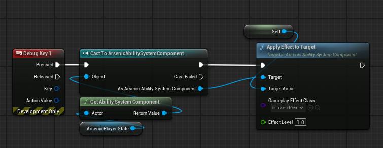

# GAS & Attributes

There isn’t a lot to document here other than a few details that will help with working with attributes and the `UArsenicAbilitySystemComponent`. Ability System blueprints are in the following file path:


---
## Attributes

We initialize attributes via gameplay effects, but because we have to think about saving and loading attribute data, we need a convenient place to store and retrieve data, and a way to dynamically set modifier magnitude values within gameplay effects. I made a **struct** in the `AArsenicCharacterBase` that sets the initial values for the attributes. In the editor, there’s a gameplay effect called `GE_InitializeAttributes` that defines which attributes to initialize. Instead of setting the `ModifierMagnitude` values in that effect, we set the `ModifierMagnitude type` to `SetByCaller` which allows us to set the attribute value in code, which is done on the `AArsenicPlayerState` class in the `InitializeAttributes` function. There’s some additional logic that determines whether or not to initialize attributes from save data or to initialize based on the default values in the struct on the base character class.

Overall, the `AArsenicPlayerState` handles the vast majority of attribute details for the player character, including binding to `OnAttributeChanged` delegates, which will be important to know how to do for other objects and classes. This approach is how we can manipulate the player’s walk speed via gameplay effects:ww

```cpp
void AArsenicPlayerState::BindAttributeDelegates()
{
	check(ArsenicAbilitySystemComponent)
	
	ArsenicAbilitySystemComponent->GetGameplayAttributeValueChangeDelegate(UArsenicAttributeSet::GetWalkSpeedAttribute()).AddUObject(this, &ThisClass::OnWalkSpeedChanged_Callback);
	ArsenicAbilitySystemComponent->GetGameplayAttributeValueChangeDelegate(UArsenicAttributeSet::GetLookSpeedAttribute()).AddUObject(this, &ThisClass::OnLookSpeedChanged_Callback);
}
```

Lastly, there’s a throwaway test effect that can be used to test how effects work without having to think about organization or structure. A design space, so to speak. Use it or don’t, it won’t end up in the final game.


---
## General GAS

The `AArsenicPlayerCharacter` class has a startup abilities **array** that defines which abilities to grant the player when the game starts. This is the easiest way to grant player abilities at startup and showcases how to grant abilities to the player at other times.

The `AArsenicCharacterBase` class has some notes on how **GAS** works that I wrote when I was taking the **GAS** course. They might help you in the future!

The `UArsenicAbilitySystemComponent` has a custom function that applies a gameplay effect to a target actor who also implements an ability system component. It’s called `ApplyEffectToTarget` and is blueprint callable:


