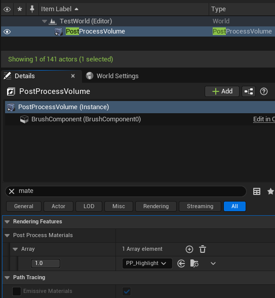
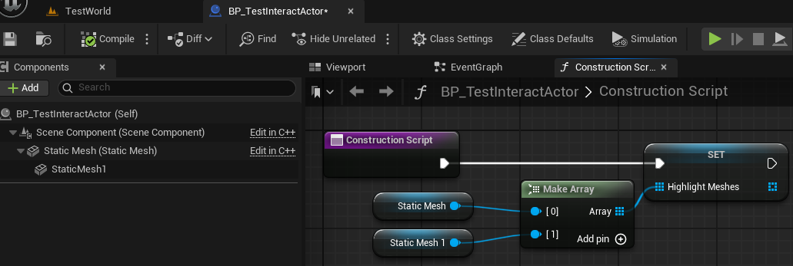
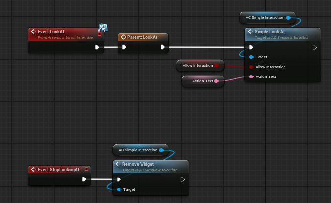
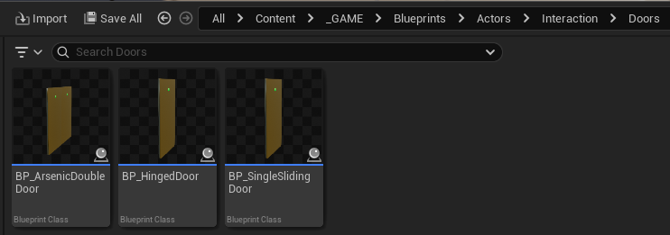
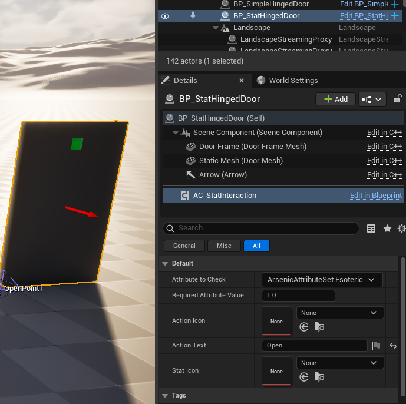

# Interaction

## AArsenicInteractActorBase

This is the class all interactable objects should inherit from as it has many useful functions, events, and variables that help inform designers and programmers of the current state of the object, along with handling mesh highlights. It comes with a few blueprint implementable events:

- `BeginHighlight();` - called when the actor gets highlighted
- `EndHighlight();` - called when the actor gets unhighlighted
- `StopLookingAt();` - called when the player stops looking at the actor

Additionally, it comes with a few helpful **blueprint-callable** functions and variables:

- `SetAllowInteraction(bool bAllowInteraction, bool bUseHighlight);`
- `HighlightMesh();`
- `UnHighlightMesh();`
- `bool isInteractable;`
- `bool isHighlighted;`

It is ***very important*** to note that the `SceneComponent` and `StaticMesh` are NOT initialized in the base class and must be set in child classes if they’re to be used:

>Initialize these in child classes by using `CreateDefaultSubobject<UCLASS>("COMPONENT_NAME);`

---
## Highlighting Meshes

Highlighting works by using a `PostProcessVolume` with `InfiniteExtent` set to `true` and the material set to `PP_Highlight`:

The highlights currently support multiple static mesh components being highlighted together, but requires that each mesh be added to the `HighlightMeshes` **array** in the construction script:

>Make sure the original static mesh is added too!

If the object only requires that 1 mesh be highlighted, no additional work is required to make the mesh highlight, as long as the mesh that comes with the actor has been initialized in the C++ constructor ( `ACLASSNAME();` ) and the mesh is set in blueprint.

---
## Simple Interact Component

This actor component (created entirely in blueprint) replaces what used to be `SimpleInteractActors` to allow for much more versatility at the cost of a little extra work, but fortunately all of that is handled in blueprint and is pretty straightforward.

This component comes with several functions that can be utilized by owning actors to create and remove the appropriate widget when looked at. Here’s a list of functions:

- `CreateSimpleWidget(FText ActionText);` - creates the interact widget 
- `RemoveWidget();` - tries to remove the interact widget
- `SetActionText(FText ActionText);`
- `SimpleLookAt(bool AllowInteraction, FText ActionText);` - Placed in owner LookAt functions to create references and automatically generate the widget
- `ConfigureWidget(FText ActionText, FInputAction InputAction);` - useful for updating the interact widget while it's still on the screen

>The simplest implementation of the component on an interact actor. These function calls are required but can be manipulated to achieve what you want

This component was designed to be implemented in classes that inherit from `AArsenicInteractActorBase`. An excellent example of this component in use is on `BP_HingedDoor`:

---
## Stat Interact Component

Shares almost all the same functions as the `Simple Interact Component` with some extra inputs to configure the stat interact widget, and a brand new **pure** function `bool HasEnoughAttributeValue(FGameplayAttribute AttributeToCheck);`

It has nearly identical setup as the `Simple Interact Component` as well:

The component can be configured on a per-instance basis by selecting it in the details panel of the interactable object:

You can find an example of this in use on `BP_HingedDoor` (See Simple Interact Component for file path)