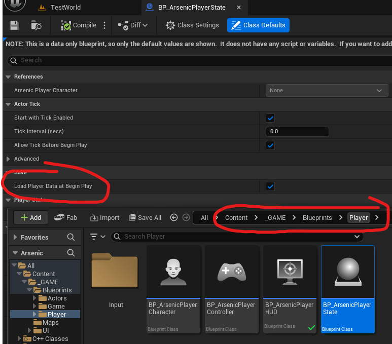

# Saving & Loading

This documentation provides an overview of the save system, examples of how to save and load data with actual game objects, and checkpoint functionality in the **Arsenic** game project.

---
## Overview

The save system utilizes **structs** to store large amounts of data per-object. Structs can be defined in the `.h` file of the object that requires saving — like in the player state:

```cpp
USTRUCT(BlueprintType)
struct FPlayerSave : public FTableRowBase
{
	GENERATED_BODY()

public:
	UPROPERTY(EditAnywhere, BlueprintReadWrite, Category = "Settings")
	FTransform PlayerTransform;

	UPROPERTY(EditAnywhere, BlueprintReadWrite, Category = "Settings")
	FRotator PlayerControlRotation;

	UPROPERTY(EditAnywhere, BlueprintReadWrite, Category = "Settings")
	float PlayerHealth;
	
	FPlayerSave() :
		PlayerTransform(FTransform(FRotator::ZeroRotator, FVector::ZeroVector, FVector(1.0f))),
		PlayerControlRotation(FRotator::ZeroRotator),
		PlayerHealth(-1.f)
	{}
};
```
Because of this approach, the `UArsenicSaveGameObject` will need to include a tremendous number of header files and variables of each object’s save **struct** type.

> This only affects compile times, not runtime optimization.

When creating your own savable object, make sure to add the **struct** as a variable in the save game object:

```cpp
UCLASS()
class ARSENIC_API UArsenicSaveGameObject : public USaveGame
{
	GENERATED_BODY()

public:
	UPROPERTY(VisibleAnywhere, BlueprintReadWrite, Category = "Save")
	FAudioSave AudioData;

	UPROPERTY(VisibleAnywhere, BlueprintReadWrite, Category = "Save")
	FGraphicsSave GraphicsData;

	UPROPERTY(VisibleAnywhere, BlueprintReadWrite, Category = "Save")
	FPlayerSave PlayerData;

	UPROPERTY(VisibleAnywhere, BlueprintReadWrite, Category = "Save")
	FCharacterAttributes PlayerAttributes;
	
	UPROPERTY(VisibleAnywhere, BlueprintReadWrite, Category = "Save")
	FControlsSave ControlsData;

	UPROPERTY(VisibleAnywhere, BlueprintReadWrite, Category = "Save")
	FPylonStateSave PylonStateData;

	UPROPERTY(VisibleAnywhere, BlueprintReadWrite, Category = "Save")
	TMap<FName, FDoorSave> DoorData;
};
```

---
The `UArsenicSaveGameSubsystem` and `IArsenicSaveGameInterface` will need functions to **set** the **struct** on the save game object — essentially just updating it with new data. This is discussed further below.

---
## Notes for Non-Programmers

- It is entirely possible that save data will create strange or buggy behavior. You can safely **delete** save data by locating the save file in the project directory:


- BP_PlayerState has a checkbox that stops the player character’s saved data from being loaded when the game starts. By default it’s set to true but you may want to avoid loading it for one reason or another:



---
## Classes

### UArsenicSaveGameSubsystem

Manages game-wide save data, general settings, and persistence. It is responsible for loading and saving game data asynchronously and tracking the state of objects as `World Partition` loads and unloads them. 
This is the central hub that controls the physical saving and loading of data in the game. 
You can access the subsystem from any class by using its static `Get` function and passing in a world context object:

```cpp
UArsenicSaveGameSubsystem* SaveSubsystem = UArsenicSaveGameSubsystem::Get(this);
```

### IArsenicSaveGameInterface

An organizational tool that stores the functions the game instance uses to save and load the various data in the game. This also ensures programmers don’t have to constantly cast to the save game subsystem and instead 
can call interface functions by using `Execute_FUNCTION_NAME` as shown below: 

```cpp
void AArsenicCheckpoint::OnTriggerBoxBeginOverlap(UPrimitiveComponent* OverlappedComponent, 
AActor* OtherActor, 
UPrimitiveComponent* OtherComp, 
int32 OtherBodyIndex, 
bool bFromSweep, 
const FHitResult& SweepResult)
{
	if (OtherActor != UGameplayStatics::GetPlayerCharacter(this, 0)) return;
	
	UArsenicSaveGameSubsystem* SaveSubsystem = UArsenicSaveGameSubsystem::Get(this);
	if (!SaveSubsystem) return;
	if (!SaveSubsystem->CanSave) return; // helps prevent an unintentional save when the player transform is updated at begin play
	
	IArsenicSaveGameInterface* SaveGameInterface = SaveSubsystem;
	FetchSaveData();
	SaveGameInterface->Execute_SetPlayerSaveData(SaveSubsystem, PlayerSaveData);
	SaveGameInterface->Execute_SetPlayerAttributes(SaveSubsystem, PlayerAttributes);
	SaveGameInterface->Execute_SetPylonSaveData(SaveSubsystem, PylonSaveData);
	SaveGameInterface->Execute_SetDoorSaveData(SaveSubsystem, SaveSubsystem->CollectedDoorData);
	SaveGameInterface->Execute_SaveGameData(SaveSubsystem);
}
```

This interface will need to be updated every time a new savable object is created, and its function will need to be implemented in the `UArsenicSaveGameSubsystem`

### UArsenicSaveGameObject

This is the container that all save data is stored in. Accessing this object will allow us to retrieve saved data, however it doesn’t have any functions of its own as of the time this documentation is written. 
Retrieving variables from this object can be done by accessing the `UArsenicSaveGameSubsystem` and calling `Execute_GetSaveGameData(SaveSubsystem)` to retrieve the `UArsenicSaveGameObject`, then accessing 
variables from that. An example is shown in the `AArsenicPlayerState`:

```cpp
void AArsenicPlayerState::SetPlayerStateFromSaveData()
{
	UArsenicSaveGameSubsystem* SaveSubsystem = UArsenicSaveGameSubsystem::Get(this);
	UArsenicSaveGameObject* SaveGameObject = IArsenicSaveGameInterface::Execute_GetSaveGameData(SaveSubsystem);

	if (SaveSubsystem->DoesSaveExist)
	{
		if (SaveSubsystem->SaveObjectInitialized)
		{
			FPlayerSave PlayerData = SaveGameObject->PlayerData;
			ArsenicPlayerCharacter->SetActorTransform(PlayerData.PlayerTransform);
			ArsenicPlayerCharacter->ArsenicPlayerController->SetControlRotation(PlayerData.PlayerControlRotation);
			
			InitializeAttributes(SaveGameObject->PlayerAttributes);
		}
		else
		{
			if (BoundToDelegate) return;
			SaveSubsystem->OnSaveGameObjectLoaded.AddDynamic(this, &ThisClass::OnSaveGameObjectLoaded_Callback);
			BoundToDelegate = true;
		}
	}
	else
	{
		FCharacterAttributes NewPlayerAttributes;
		InitializeAttributes(NewPlayerAttributes);
	}
}
```

### AArsenicCheckpoint

This class is an example of how to save an object’s data. We will likely be using this object for a long time, and it will likely be growing as our savable objects are added to the game. 
The code is quite simple, I will let it speak for itself. It can be found in Actors->ArsenicCheckpoint. There is a blueprint version that gets added to the world as a checkpoint.

---
## Loading Data

So far, the system only has two examples of loading data and that can be found in the `AArsenicPlayerState` and `AArsenicDoorBase`. Loading data is far simpler than you may expect so I won’t 
explain it here, but it’s important to know where to find the examples: Player->AArsenicPlayerState & Actors->Interaction->Doors->ArsenicDoorBase. The doors are an excellent example of
tracking their state as `World Partition` loads and unloads them. I'm very proud of this feature!

---
## Creating New Savable Objects

This is a very brief guide on the requirements to register your object with the save system:

1. Within the header file of your savable object, create a **struct** that contains all necessary information. 
2. Add that **struct** as a variable to `UArsenicSaveGameObject` (you will need to add the header file too)
3. Create a function in `IArsenicSaveGameInterface` that takes your **struct** as an input
4. Implement that interface function in `UArsenicSaveGameSubsystem` (use the other functionss as a guide). Ensure this function sets your **struct** on the save game object
5. Create a getter function in your savable object that returns your **struct**, but actually populates it with current data before doing so (this will be fetched by the checkpoint)
6. Within `AArsenicCheckpoint`, add to `FetchSaveData` and `OnTriggerBoxBeginOverlap` to include your new functions. Feel free to create a member variable here for your **struct** if you need it
7. On `BeginPlay` in your savable object, create logic that sets the state of your object back to the loaded data. You may need `SetActorTransform`, `SetActorRotation`, `SetHealth`, etc. This 
is where the savable object actually uses the saved data that gets loaded. There is a bool on the `UArsenicSaveGameSubsystem` (`SaveObjectInitialized`) that gets set to true when the save game 
object is loaded; use this if you want to ensure the save game object is actually initialized before accessing it.

---
## Helfup Tip For Accessing Save Data

Because objects get initialized at different times, it’s important that we access objects only after they’ve been fully initialized. The `UArsenicSaveGameSubsystem` initializes the 
`UArsenicSaveGameObject` that holds all the saved data, and as such has a delegate that gets broadcast when that happens, called `FOnSaveGameObjectLoadedDelegate`. This works in tandem with the 
bool on the game instance called `SaveObjectInitialized`. For example:

```cpp
void AArsenicPlayerState::SetPlayerStateFromSaveData()
{
	UArsenicSaveGameSubsystem* SaveSubsystem = UArsenicSaveGameSubsystem::Get(this);
	UArsenicSaveGameObject* SaveGameObject = IArsenicSaveGameInterface::Execute_GetSaveGameData(SaveSubsystem);

	if (SaveSubsystem->DoesSaveExist)
	{
		if (SaveSubsystem->SaveObjectInitialized)
		{
			FPlayerSave PlayerData = SaveGameObject->PlayerData;
			ArsenicPlayerCharacter->SetActorTransform(PlayerData.PlayerTransform);
			ArsenicPlayerCharacter->ArsenicPlayerController->SetControlRotation(PlayerData.PlayerControlRotation);
			
			InitializeAttributes(SaveGameObject->PlayerAttributes);
		}
		else
		{
			if (BoundToDelegate) return;
			SaveSubsystem->OnSaveGameObjectLoaded.AddDynamic(this, &ThisClass::OnSaveGameObjectLoaded_Callback);
			BoundToDelegate = true;
		}
	}
	else
	{
		FCharacterAttributes NewPlayerAttributes;
		InitializeAttributes(NewPlayerAttributes);
	}
}
```

If `SaveObjectInitialized` returns false, that means the game instance hasn’t fully initialized our save game object and we cannot safely access the saved data. Instead (else), we simply 
bind to the `OnSaveGameLoaded` delegate which re-calls `SetPlayerStateFromSaveData` when the game instance broadcasts that it has successfully initialized the save game object. Here’s the callback for 
reference:

```cpp
void AArsenicPlayerState::OnSaveGameObjectLoaded_Callback()
{
	SetPlayerStateFromSaveData();
}
```